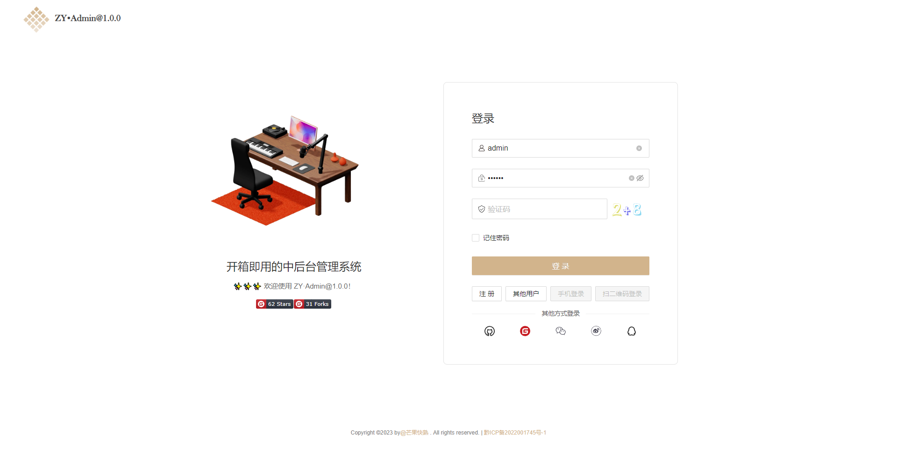
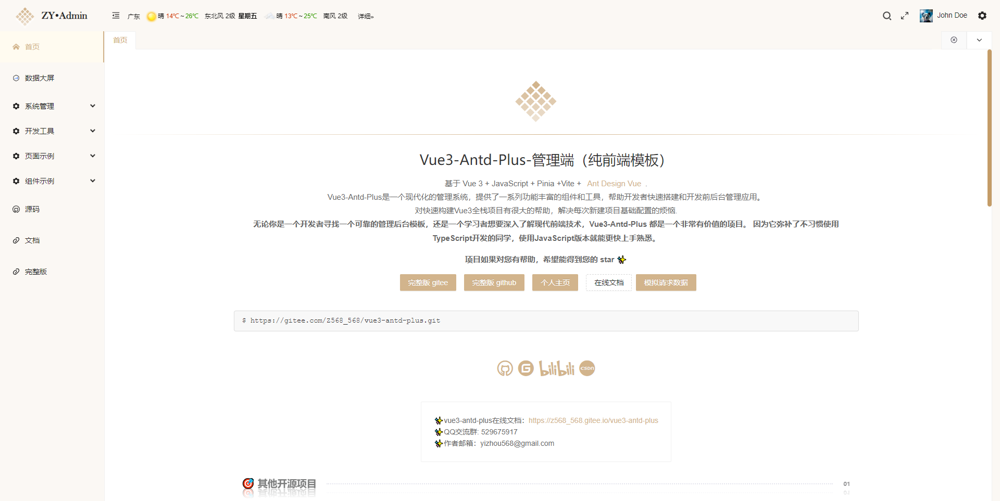
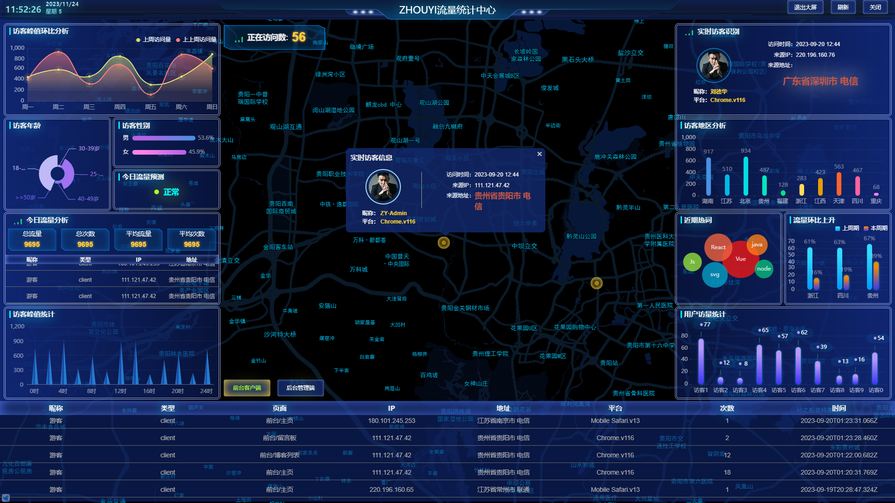
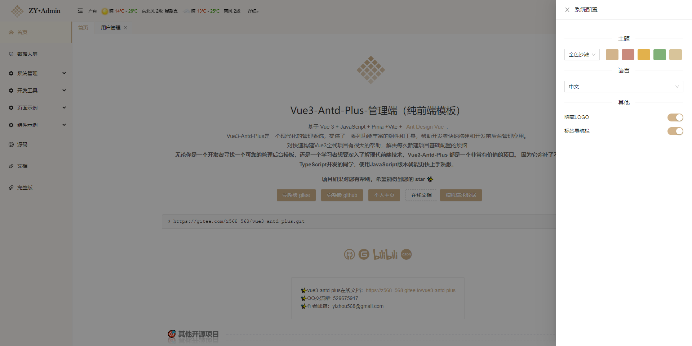
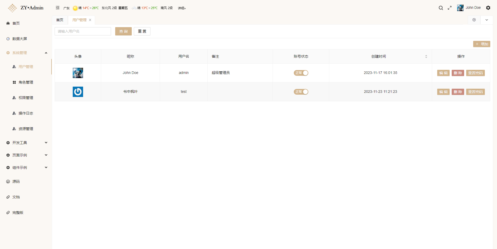
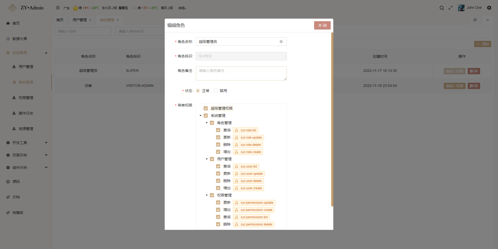
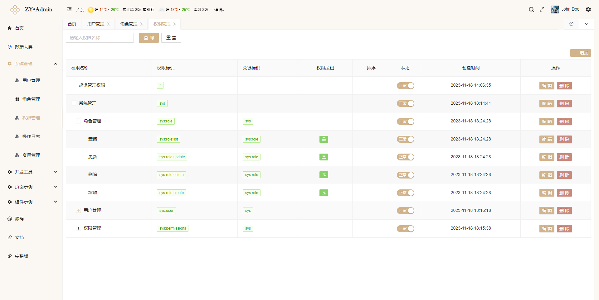
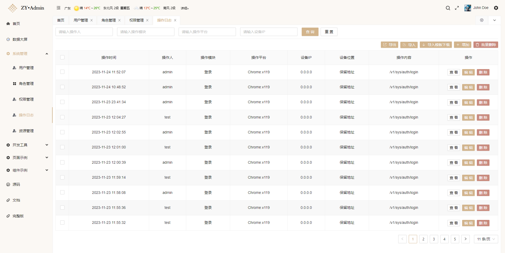
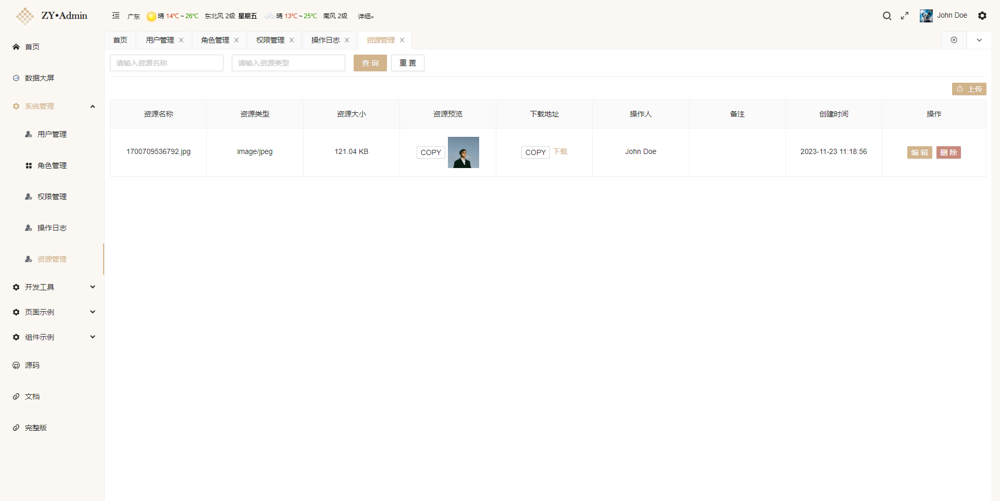

# Vue3-Admin-JS-Mysql

#### 介绍

🎉2023中后台管理系统基于最新的技术栈`（Vue3、Vite4、Ant Design Vue3、JavaScript、Pinia、Hooks、vue-router4、Mysql数据库）`的基础前后端分离开发模板。

项目中我采用的**权限设计方案**属于基于角色的访问控制`（Role-Based Access Control，RBAC）`。
`RBAC` 是一种常见且广泛使用的权限管理模型，它通过将用户分配到不同的角色，然后将角色与特定的权限关联，来实现对系统资源的访问控制。

- 在线预览可参考：[ZHOUYI'ADMIN](http://admin.zhouyi.run/)
- 项目文档可参考：[👍开箱即用的前后端分离管理系统](https://z568_568.gitee.io/vue3-antd-plus/)

> 🎯 如果项目对你有帮助，可以帮帮忙点个小星星，谢谢了~

#### QQ群：529675917

找到作者

- [个人主页](https://www.zhouyi.run/)
- [gitee](https://gitee.com/Z568_568)
- [github](https://github.com/ZHYI-source)

#### 项目截图











#### 软件架构

- ADMIN ( 管理端 ): `Vue3、Vite4、Ant Design Vue3、JavaScript、Pinia、Hooks、vue-router4`
- SERVER ( 服务端 ): `Node.js、Express.js、Mysql5.6、Sequelize`

#### 功能模块

- [x] 用户登录、注册
- [x] 用户管理
- [x] 角色管理
- [x] 权限管理
- [x] 操作日志
- [x] 数据大屏
- [x] 资源管理、图片文件上传下载
- [x] 自定义主题、菜单权限、按钮权限等等

#### 安装教程

默认你的已经安装好node环境、mysql5.* 数据库、vue3、navicat(软件 可选)

#### clone 代码

```javascript
git
clone
https://gitee.com/Z568_568/Vue3-Admin-JS-Mysql.git
```

#### 启动 SERVER ( 服务端 )

##### 1.建数据库

打开navicat连接mysql，新建数据库 mealpass - 运行sql文件（`SERVER/sql/mealpass.sql`）

##### 2.修改项目配置

找到`SERVER/.env.development`修改成你的数据库信息

```shell
DB_NAME=mealpass # 数据库名称
DB_USERNAME=root # 数据库用户名
DB_PASSWORD=root # 数据库密码
```

##### 3.安装依赖并启动服务

```shell
# 依次输入下面命令
> npm i
> node app.js 或者 nodemon app.js (全局安装 nodemon 情况下使用)
```

##### 4.启动成功示例

```shell
****************************************************
【接口地址】: http://localhost:3000/v1
【文档地址】: http://localhost:3000/swagger
【在线API文档】: https://console-docs.apipost.cn/preview/38398488376e89f7/a8cca560fbceec30
【启动环境】：开发环境
【项目作者】：ZHOUYI  https://www.zhouyi.run
****************************************************
******************数据库连接成功********************
【数据库】：数据库连接已成功建立.
【数据库主机】：localhost
【数据库名称】：mealpass
【数据库状态】：数据库和表已同步
******************数据库连接成功********************

```

#### 启动 ADMIN ( 管理端 )

##### 1.安装依赖并启动服务

```shell
# 依次输入下面命令
> npm i
> npm run dev
```

##### 2.启动成功示例

```shell
  VITE v4.2.1  ready in 2077 ms

  ➜  Local:   http://localhost:3090/
  ➜  Network: http://192.168.0.15:3090/
  ➜  press h to show help

```

> 管理端启动成功后账号密码：admin 123456

#### 其他相关开源项目

> [👆vue3-antd-plus mongodb数据库版](https://gitee.com/Z568_568/vue3-antd-plus.git)

> [👆vue3+mongodb个人主页简历个人博客前后端分离系统](https://gitee.com/Z568_568/ZHOUYI-Homepage.git)

> [😜vue2+mysql博客全栈系统系统](https://gitee.com/Z568_568/all-blog-sys.git)
